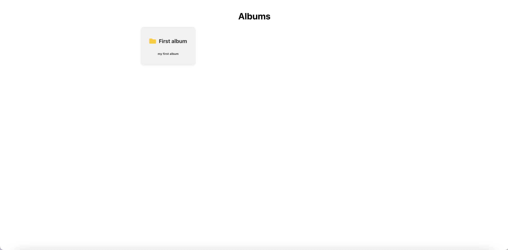
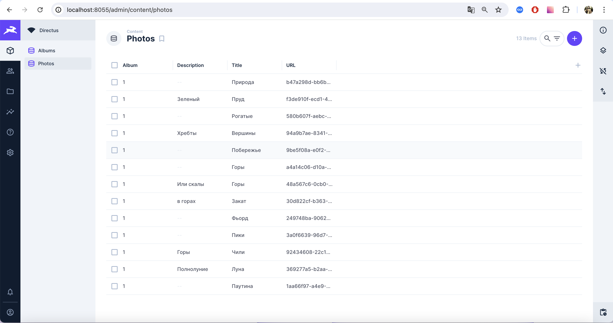

# Gallery Project

## Содержание

- [Описание](#описание)
- [Требования](#требования)
- [Установка](#установка)
- [Запуск проекта](#запуск-проекта)
- [Переменные окружения](#переменные-окружения)
- [Структура проекта](#структура-проекта)
- [Инструкции для разработки](#инструкции-для-разработки)

## Описание

## Наше приложение представляет собой адаптивную веб-галерею, созданную с использованием Directus для управления контентом и React для фронтенда. Основные функции приложения включают:

### Адаптивная верстка и загрузка изображений

Адаптивная верстка: Верстка приложения разработана таким образом, чтобы корректно отображаться на всех устройствах, независимо от размера экрана. Изображения любых размеров и соотношений сторон не нарушают компоновку страницы благодаря продуманной CSS-разметке.
Загрузка изображений любых размеров и соотношений сторон, при этом верстка страницы не ломается, так как изображения автоматически подстраиваются под доступные области.

### Пагинация фотографий

В списке фотографий реализована пагинация, которая позволяет пользователю удобно просматривать большое количество изображений, разделяя их на страницы.

### Механизм альбомов

Фотографии загружаются не в общую галерею, а в конкретные альбомы. На главной странице вместо общего списка фотографий отображается список альбомов. Это позволяет пользователям лучше организовать свои фотографии. При клике на альбом происходит переход на страницу со списком фотографий в данном альбоме.

### Модальное окно для фотографий

Каждое фото можно открыть во всплывающем окне.
Переключение фото: Реализована возможность переключения фотографий внутри альбома с помощью стрелок, не покидая всплывающего окна.

### Роутинг и навигация

Роутинг: Приложение поддерживает роутинг, который позволяет скопировать ссылку на любой альбом и фото внутри него. При открытии ссылки на фото пользователь сразу попадает на страницу соответствующего альбома с открытым всплывающим окном нужного фото. При переключении фотографий в модальном окне с помощью стрелки "назад" браузера пользователь может “отмотать” свои действия.

### Поддержка превьюшек

Для улучшения производительности и уменьшения времени загрузки изображений, поддерживается механизм превьюшек. Сжатие размеров изображений происходит на сервере, что позволяет уменьшить нагрузку на клиент.

### Контейнеризация

Приложение обернуто в Docker-контейнер. Настроен Docker Compose для одновременного запуска фронтенда и сервера Directus, что облегчает развертывание.
Стек технологий
Backend: Directus, использующий SQLite для хранения данных.
Frontend: React с использованием SCSS для стилизации и стейтменеджера MobX.

Это приложение предоставляет пользователям удобный интерфейс для организации и просмотра фотографий, обеспечивая при этом высокую производительность и адаптивность на всех устройствах.

## Требования

- Docker
- Docker Compose
- Git

## Установка

1. Клонируйте репозиторий:

   ```sh
   git clone https://github.com/yourusername/your-repo.git
   cd your-repo
   ```

2. Создайте файлы `.env` для фронтенда и бэкенда на основе примеров:

   ```sh
   cp frontend/.env.example frontend/.env
   cp backend/.env.example backend/.env
   ```

3. Отредактируйте файлы `.env` и укажите необходимые значения.

## Запуск проекта

1. Соберите и запустите контейнеры:

   ```sh
   docker-compose up --build
   ```

2. Приложение будет доступно по адресу `http://localhost:3000`, а Directus API по адресу `http://localhost:8055`.

## Переменные окружения

### Фронтенд

**frontend/.env.example**:

```dotenv
REACT_APP_API_URL=http://localhost:8055
```

## Админка Directus

### Логин admin@admin.com

### Пароль adminpassword

## Скрины приложения





